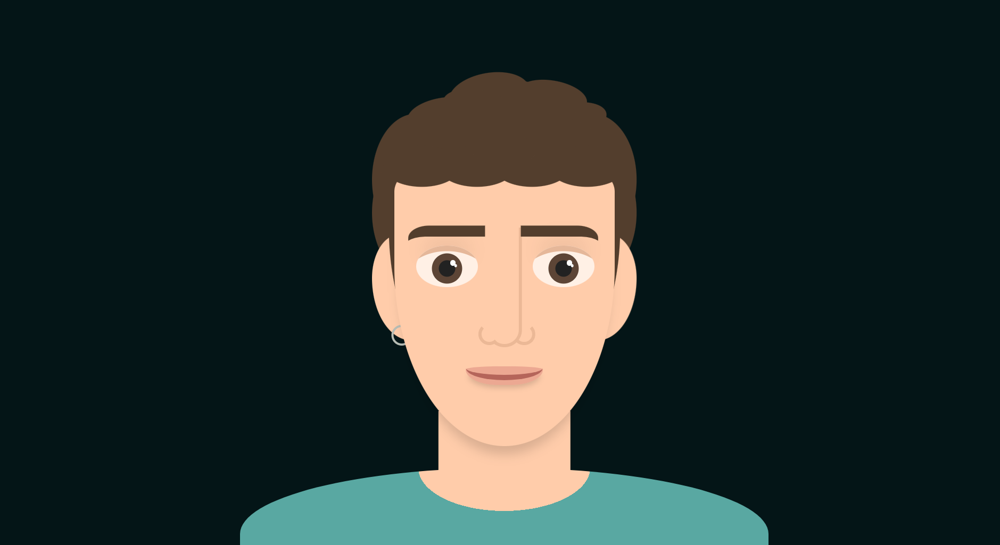

#  CSS Art: Retrato Geométrico Personalizado

##  Sobre el proyecto

Este proyecto es un ejercicio avanzado de desarrollo Frontend que consiste en crear una ilustración de mi rostro utilizando **únicamente HTML y CSS puro**. 

No se han utilizado archivos de imagen externos (`.png`, `.jpg`) ni gráficos vectoriales importados (`.svg`). Todo el diseño, las formas geométricas, los sombreados y los detalles anatómicos están construidos a base de matemáticas CSS: manipulando el DOM, anidando elementos `
` y aplicando un uso intensivo de propiedades como `box-shadow`, `border-radius` variables y pseudoelementos (`::before`, `::after`).

El objetivo es utilizar este arte CSS como elemento central para mi landing page y marca personal, garantizando un rendimiento óptimo y una buena escalabilidad sin pérdida de calidad.

##  Características destacadas

* **100% Código Puro:** Renderizado nativo en el navegador sin recursos externos.
* **Estilo Flat Design:** Estética limpia, geométrica y estructurada inspirada en el diseño de iconos modernos.
* **Escalabilidad Perfecta:** El diseño utiliza unidades `vmin` para asegurar que el retrato sea completamente *responsive* y mantenga sus proporciones en cualquier tamaño de pantalla.
* **Sistema de Variables (Custom Properties):** Paleta de colores centralizada para facilitar temas claros/oscuros o cambios de estilo rápidos.
* **Textura Paramétrica:** Simulación de cabello rizado utilizando superposición de sombras e inyección de elementos.

##  Tecnologías utilizadas

* **HTML5:** Semántica y estructuración de las capas del dibujo.
* **CSS3:**
  * Custom Properties (Variables)
  * Posicionamiento Absoluto
  * `box-shadow` múltiple (para volúmenes y detalles sin añadir más HTML)
  * `border-radius` avanzado (curvas elípticas y formas asimétricas)
  * Pseudo-elementos para reducir el anidamiento del DOM.

##  Cómo visualizar el proyecto

Al ser código estático puro, no requiere de ningún entorno de servidor complejo ni dependencias de Node.js para visualizarse.

Puedes visualizarlo accediendo a [My Face](https://hugooomaciias.github.io/my_face/)